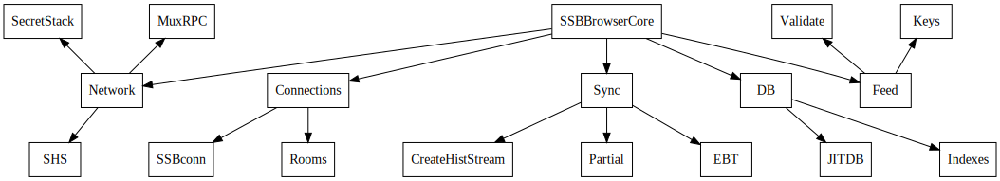

# SSB browser core

Secure scuttlebutt core (similar to [ssb-server]) in a browser.

This is a full implementation of ssb running in the browser only (but
not limited to, of course). The key of your feed is stored in the
browser together with the log, indexes and smaller images. To reduce
storage and network requirements, partial replication has been
implemented. Wasm is used for crypto and is around 90% the speed of
the C implementation. A WebSocket is used to connect to pubs or
rooms. The `bundle-core.js` file in dist/ is roughly 2mb.

Replication in the browser is quite a bit slower than in node, around
2x. There doesn't seem to be a single cause, it appears to be all the
diferrent layers that are [slower]: end-to-end encryption, database
write etc.

SSB conn is used for connections and rooms are supported. Partial
replication is implemented which allows two connected browsers to do a
partial sync.

Partial replication [speed] on a fast laptop is roughly 425 feeds in 56
seconds, and roughly half of that on a slow laptop or when running on
battery.



Boxes represent modules, some internal to browser-core and some
external. Ellipses in gray represents overall areas and are thus not
modules.

<details>
3`graphviz
digraph hierarchy {
nodesep=0.6 node [shape=record];

{ rank=same SSBBrowserCore Validate Keys } 
{ rank=same SSBBrowserCore SecretStack MuxRPC }

Network [shape=ellipse style=filled]
Connections [shape=ellipse style=filled]
Sync [shape=ellipse style=filled]
Feed [shape=ellipse style=filled]

SSBBrowserCore->{Network Connections Sync SSBDB2 Feed} Feed->{Validate Keys} Connections->{SSBconn Rooms} Network->{SecretStack MuxRPC SecretHandshake} Sync->{FeedSyncer EBT Blobs} SSBDB2->{Indexes JITDB AsyncAppendOnlyLog } }
3`
</details>

# api

Once you load the `bundle-core.js` file in a browser a global SSB
object will be available.

The api is not meant to be 100% compatible with regular
ssb-db. Overall there are two major parts: [`db`](#db) and
[`net`](#net).

# config

Loading the bundle-core file as above will use `browser.js`, meaning
default options. It is also possible to overwrite config options,
like:

```
require('../core.js').init(dir, { blobs: { max: 512 * 1024 } })
```

Default config options are defined in `net.js`.

## Runtime configurations

### hops

The number of hops from which to store feeds in full. Hops + 1 will be
stored in partial state, meaning profiles, contacts and latest
messages will be stored.

Default is 1.

## db

This is the [ssb-db2] module.

### contacts

The contacts index for the friends graph.

Contains the method `getGraphForFeed(feed, cb)` that will return an
object of: following, blocking and extended given the feed.

### profiles.get(cb)

Returns the profiles index.

## net

This is the [secret-stack] module with a few extra modules
loaded. [ssb-ws] is used to create web socket connections to pubs.

### id

The public key of the current user

### rpc:connect event

Example:

```
SSB.net.on('rpc:connect', (rpc) => {
  console.log("connected")
  rpc.on('closed', () => console.log("bye"))
})
```

### connectAndRemember(addr, data)

Will connect and store as to automatically reconnect on
reload. Options are as described in [ssb-conn].

### connect(addr, cb)

Connect to addr only once. Cb is (err, rpc)

### blobs

This is where the `blobs` api can be found. The module implements the
blobs protocol and so can exchange blobs with connection peers. It
also contains with the the following extra methods:

#### hash(data, cb)

Hashes data and returns the digest or err

Example:
```
onFileSelect: function(ev) {
  const file = ev.target.files[0]
  file.arrayBuffer().then(function (buffer) {
    SSB.net.blobs.hash(new Uint8Array(buffer), (err, digest) => {
      console.log(digest)
    })
  })
}
```

#### add(blobId, file, cb)

Adds the `file` (such as one obtained from ev.target.files when using
a file select) to the blob store using the blobId name. BlobId is & +
hash.

#### remoteURL(blobId)

Returns a http URL string for the current connection. This is useful
in a browser for images that you don't want to store directly on the
device.

#### privateGet(blobId, unbox, cb)

Callback with err or a url that works for e.g images that was received
in a private message.

#### localGet(blobId, unbox, cb)

If blob already exists will callback with err or a url that can be
used for images for a blob. Otherwise the blob will get requested and
if size is smaller than the maximum size, the blob will be stored
locally and used for callback, otherwise the callback will return a
`remoteURL` link.

### ooo

The [ssb-ooo] module

### Browser specific methods on net

For partial replication a special plugin has been created and
implemented in browser core, other clients such as a pub needs to have
the [ssb-partial-replication] plugin installed.

Once a rpc connection has been established, a few extra methods are
available under SSB.net.partialReplication. See plugin for
documentation.

## SSB

Other things directly on the global SSB object

### dir

The path to where the database and blobs are stored.

### getPeer()

Gets one of the connected peers that is not a room server.

### box

[box](https://github.com/ssbc/ssb-keys#boxcontent-recipients--boxed)
method from ssb-keys. Useful for private messages.

### blobFiles

The [ssb-blob-files] module.

### SSB: loaded event

Because loading wasm is async, an event will be fired when `SSB` is
ready to use. Example:

```
SSB.events.on('SSB: loaded', function() {
  console.log("ready to rock!")
})
```

&nbsp;
&nbsp;

There are a few other undocumented methods, these will probably be
moved to another module in a later version as they are quite tied to
[ssb-browser-demo].

# Browser compatibility

Tested with Chrome and Firefox. Chrome is faster because it uses fs
instead of indexeddb. Also tested on android using Chrome and iOS
using safari.

# Building

Run `npm run build` for debugging and `npm run release` for a smaller
dist file.

For a smaller bundle file you can apply (patch -p0 < x.patch):
 - patches/sodium-browserify.patch

[ssb-server]: https://github.com/ssbc/ssb-server
[ssb-browser-demo]: https://github.com/arj03/ssb-browser-demo
[secret-stack]: https://github.com/ssbc/secret-stack
[ssb-ws]: https://github.com/ssbc/ssb-ws
[ssb-blob-files]: https://github.com/ssbc/ssb-blob-files
[ssb-ooo]: https://github.com/ssbc/ssb-ooo
[ssb-conn]: https://github.com/staltz/ssb-conn
[ssb-db2]: https://github.com/ssb-ngi-pointer/ssb-db2

[ssb-get-thread]: https://github.com/arj03/ssb-get-thread
[ssb-partial-replication]: https://github.com/arj03/ssb-partial-replication
[jitdb]: https://github.com/arj03/jitdb

[slower]: https://github.com/arj03/ssb-browser-core/blob/master/scripts/sync.js#L17
[speed]: https://github.com/arj03/ssb-browser-core/blob/master/scripts/full-sync.js
